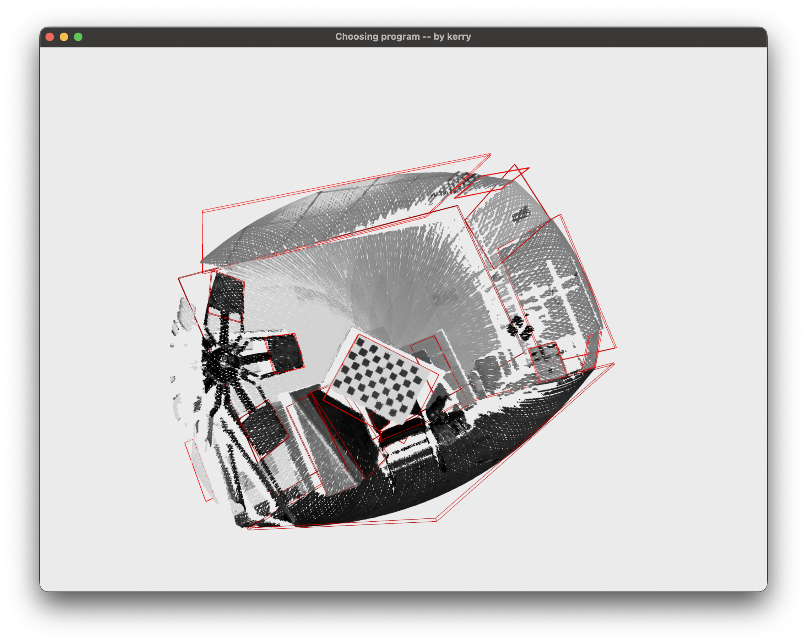
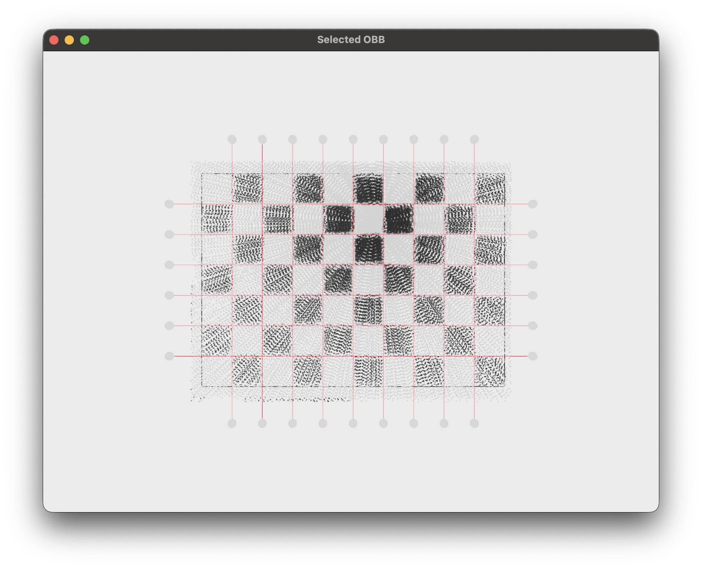

# 首次运行需要执行以下命令 #
chmod +x startup.sh run.sh
./scripts/startup.sh

# 运行方法 #
conda activate RadarPcd
./run.sh
conda deactivate

# 软件使用方法 #
1. 在主界面选择标定板所在平面

2. 在新弹出的界面微调经纬线位置，选完后直接关闭界面即可

2.1 粗调：直接直接拖动界面上的灰色球体
2.2 细调：点按灰色球体直至其变蓝，即可用键盘上的 “+” 使小球向右或向上移动，“-” 使小球向左或向下移动

3. 进行完选点之后，可以在主界面上看到蓝色选点 

# 项目工程讲解 #
1. 脚本介绍：
1.1 scripts/startup.sh 用于项目环境构建
1.2 run.sh 用于运行项目

2. 代码模块介绍：
2.1 CsvIO 专门负责文件读写操作
2.2 logger 负责管理调试输出相关配置，更改调试等级可以在 main 函数中的 logger.setup_logger(level=logger.SUGGESTION) 处进行
2.3 CalibrationApplicator PlateSelectionWidgetor FineTuningWidgetor 这三个模块负责管理窗口
2.4 PcdAligner PcdDimension PcdDownsample PlateExtraction 是一些功能型模块

3. 项目文件简介：
   ├── res/                       # csv 格式雷达点云
   ├── output/                    # 存放点的位置（运行后产生）
   ├── src/                       # 代码
   │   ├── CsvIO.py
   │   ├── logger.py
   │   ├── CalibrationApplicator.py
   │   ├── PlateSelectionWidgetor.py
   │   ├── FineTuningWidgetor.py
   │   ├── PcdAligner.py
   │   ├── PcdDimension.py
   │   ├── PcdDownsample.py
   │   ├── PlateExtraction.py
   │   └── main.py
   ├── docs/                      # README.md 需要的图片资源
   ├── startup.sh
   └── run.sh

# 声明 #
1. 本项目为个人项目，仅供学习交流使用，不涉及任何商业用途  
2. 如果有任何问题或建议，请联系作者：13670196946@163.com
